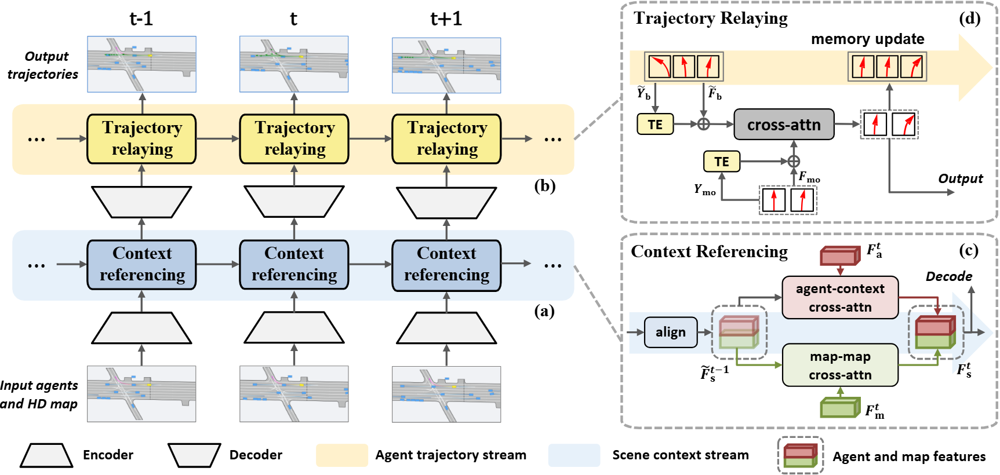

# Motion Forecasting in Continuous Driving


> [**Motion Forecasting in Continuous Driving**](https://arxiv.org/abs/2410.06007)            
> Nan Song, [Bozhou Zhang](https://zbozhou.github.io/), [Xiatian Zhu](https://surrey-uplab.github.io/), [Li Zhang](https://lzrobots.github.io)   
> **NeurIPS 2024**

## 🚗 Abstract
Motion forecasting for agents in autonomous driving is highly challenging due to the numerous possibilities for each agent's next action and their complex interactions in space and time. In real applications, motion forecasting takes place repeatedly and continuously as the self-driving car moves. However, existing forecasting methods typically process each driving scene within a certain range independently, totally ignoring the situational and contextual relationships between successive driving scenes. This significantly simplifies the forecasting task, making the solutions suboptimal and inefficient to use in practice. To address this fundamental limitation, we propose a novel motion forecasting framework for continuous driving, named RealMotion. It comprises two integral streams both at the scene level: (1) The scene context stream progressively accumulates historical scene information until the present moment, capturing temporal interactive relationships among scene elements. (2) The agent trajectory stream optimizes current forecasting by sequentially relaying past predictions. Besides, a data reorganization strategy is introduced to narrow the gap between existing benchmarks and real-world applications, consistent with our network. These approaches enable exploiting more broadly the situational and progressive insights of dynamic motion across space and time. Extensive experiments on Argoverse series with different settings demonstrate that our RealMotion achieves state-of-the-art performance, along with the advantage of efficient real-world inference.

## 🎞️ Pipeline
<div align="center">
  
</div><br/>

## 🛠️ Get started

### Set up a new virtual environment
```
conda create -n motion python=3.10
conda activate motion
```

### Install dependency packpages
```
pip install torch==2.0.1 torchvision==0.15.2 torchaudio==2.0.2 --index-url https://download.pytorch.org/whl/cu118
pip install -r requirements.txt
pip install natten==0.17.3+torch200cu118 -f https://shi-labs.com/natten/wheels
```

## 🕹️ Prepare the data
### Setup [Argoverse 2 Motion Forecasting Dataset](https://www.argoverse.org/av2.html)
```
data
    ├── train
    │   ├── 0000b0f9-99f9-4a1f-a231-5be9e4c523f7
    │   ├── 0000b6ab-e100-4f6b-aee8-b520b57c0530
    │   ├── ...
    ├── val
    │   ├── 00010486-9a07-48ae-b493-cf4545855937
    │   ├── 00062a32-8d6d-4449-9948-6fedac67bfcd
    │   ├── ...
    ├── test
    │   ├── 0000b329-f890-4c2b-93f2-7e2413d4ca5b
    │   ├── 0008c251-e9b0-4708-b762-b15cb6effc27
    │   ├── ...
```

### Preprocess
```
python preprocess.py -d /path/to/data -p
```

### The structure of the dataset after processing
```
└── data
    └── realmotion_processed
        ├── train
        ├── val
        └── test
```

## 🔥 Training and testing
```
# Train
python train.py

# Val
python eval.py checkpoint=/path/to/ckpt

# Test for submission
python eval.py checkpoint=/path/to/ckpt submit=true
```

## ⭐ Results and checkpoints

| Models | minADE1 | minFDE1 | minADE6 | minFDE6 | b-minFDE6 | Checkpoint |
| :-- | :-: | :-: | :-: | :-: | :--: | :-: |
| RealMotion-I   |  1.808  |  4.510  |  0.728  |  1.420 | 2.043  | [remotion_i.pth](https://drive.google.com/file/d/1MY4OfoEdoqFTdfDrHqcmo1pAUgUz1Gea/view?usp=drive_link)
| RealMotion |  1.646  |  4.100  |  0.669  |  1.303  | 1.935 |[remotion.pth](https://drive.google.com/file/d/1qyT0HHTMtpsvGy6YFo-jlp-1b-oNGbMr/view?usp=drive_link)


## 📜 BibTeX
```bibtex
@inproceedings{song2024realmotion,
 title={Motion Forecasting in Continuous Driving},
 author={Song, Nan and Zhang, Bozhou and Zhu, Xiatian and Zhang, Li},
 booktitle={NeurIPS},
 year={2024},
}
```

## ❤️ Acknowledgements
 - [Forecast-MAE](https://github.com/jchengai/forecast-mae)
 - [StreamPETR](https://github.com/exiawsh/StreamPETR)
 - [DeMo (Ours)](https://github.com/fudan-zvg/DeMo)
